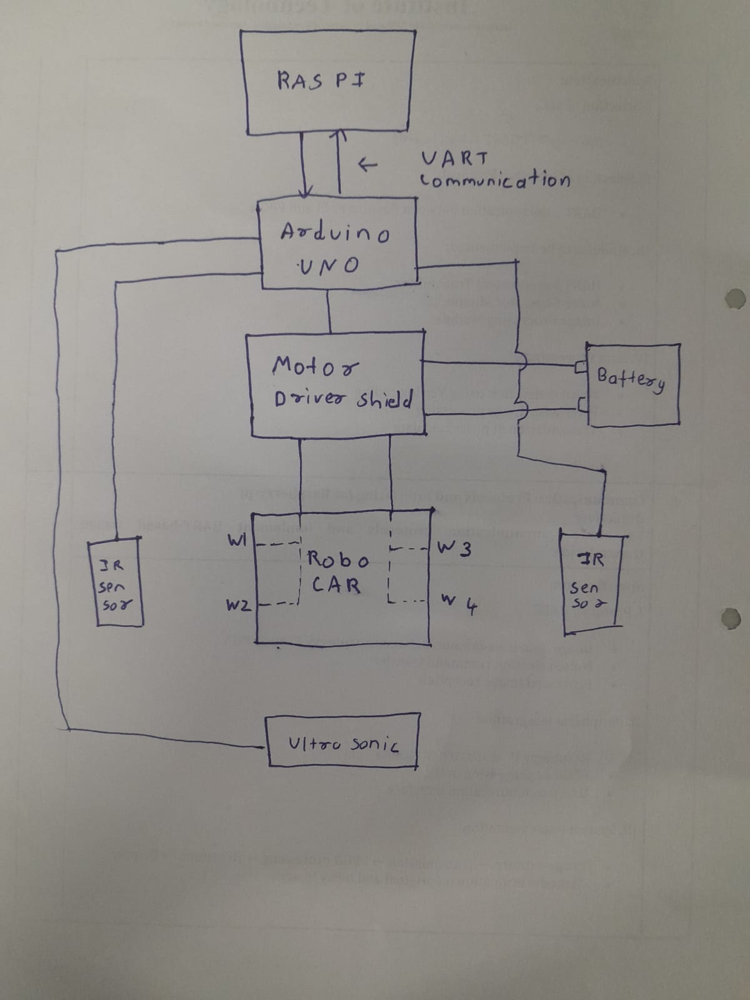
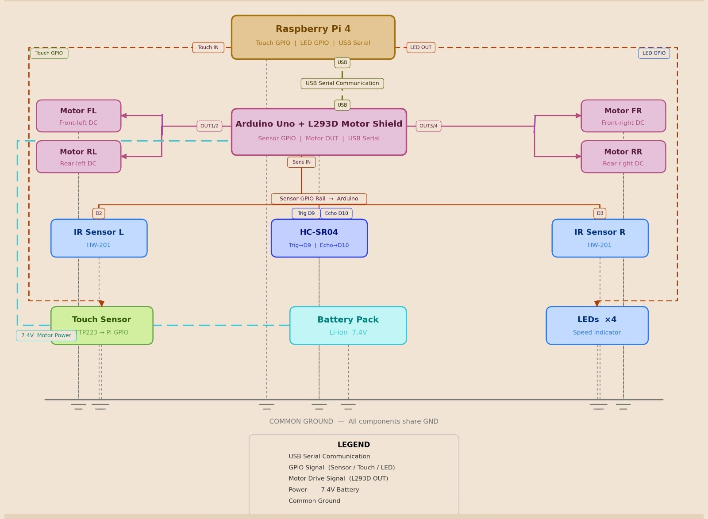
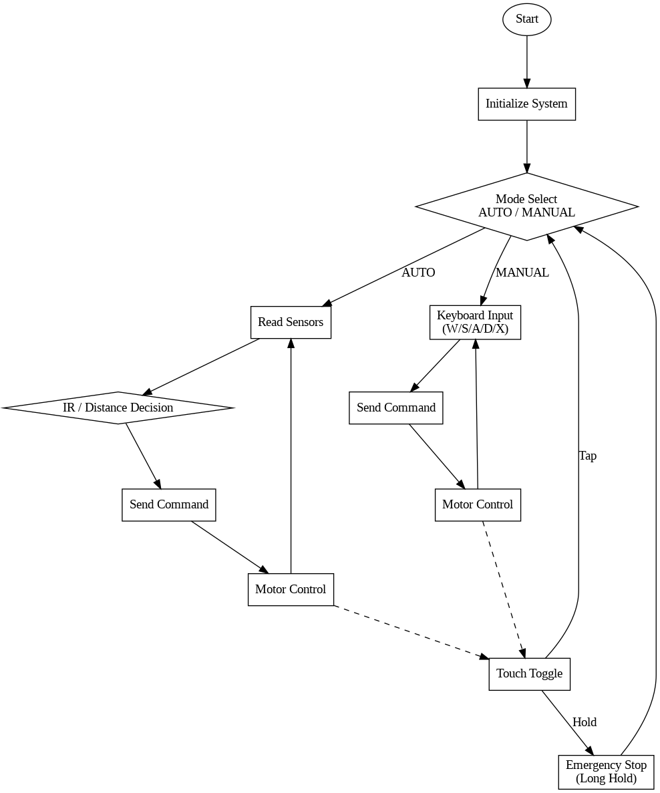
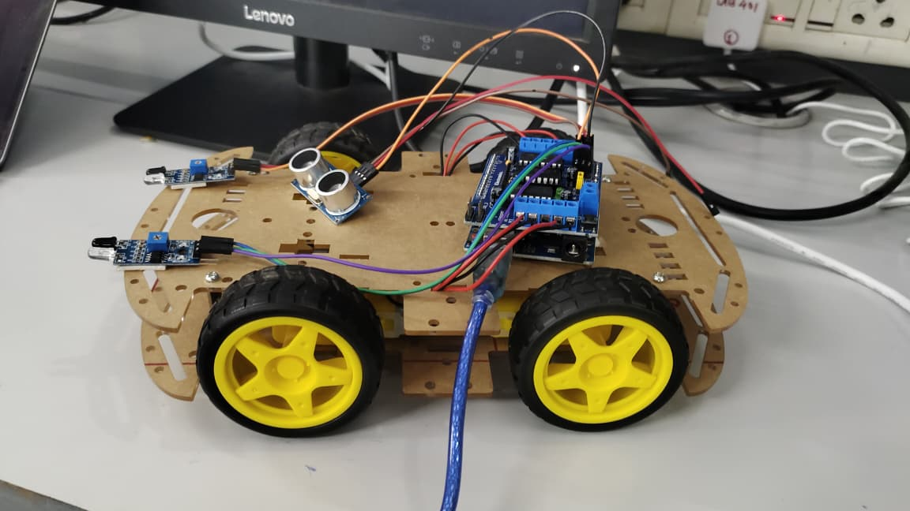
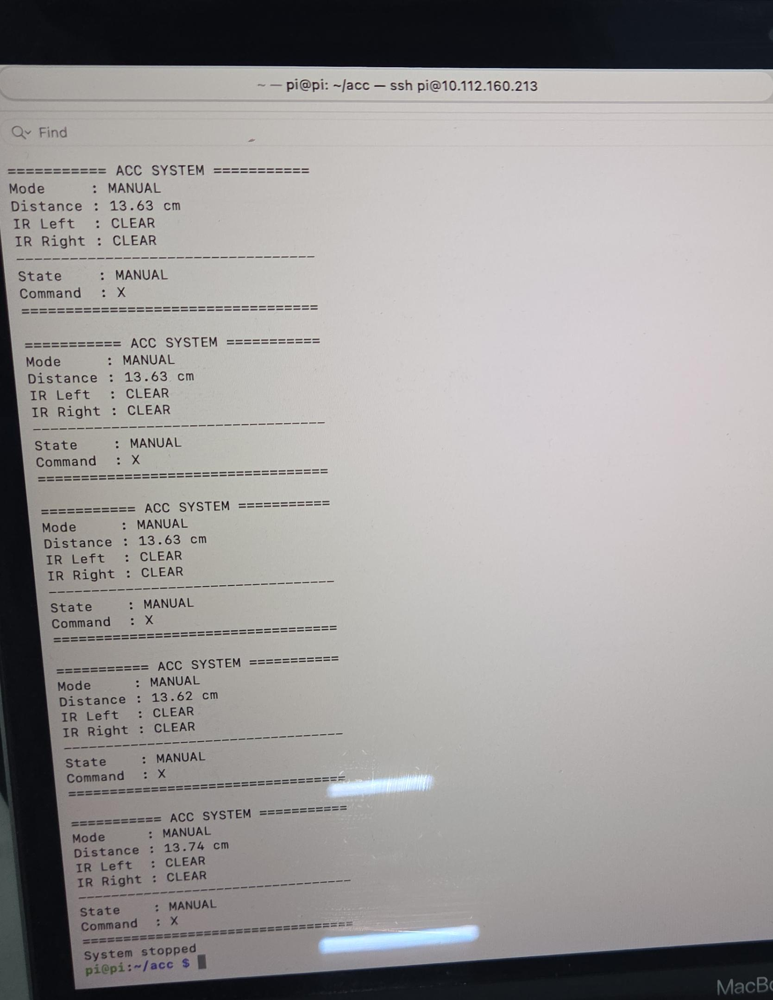
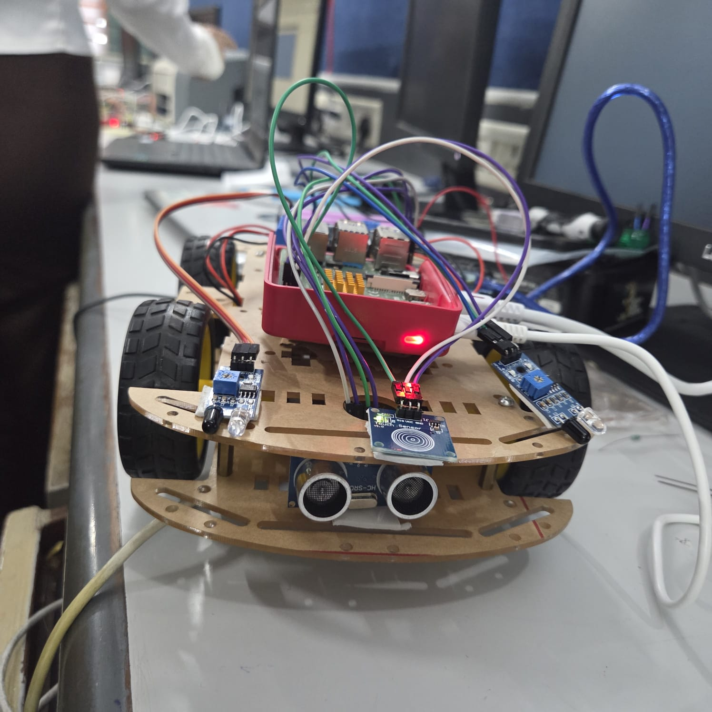

# SKILL LAB PRACTICAL HACKATHON
## Final Project README

---

# 1. Team Identity

## 1.1 Studio / Group Name

ControlLoop

## 1.2 Team Members

| Name | Primary Role | Secondary Role | Strengths Brought to the Project |
| --- | --- | --- | --- |
| Krishnan H | Raspberry Pi Lead | Integration | Built Decision Logic |
| Dheeraj Moolya | Raspberry Pi Support | Documentation | Assisted in setup And documentation |
| Nidhi Bamhane | Arduino Lead | Motor Control | Developed Hardware control |
| Rushikesh Sose | Research Support | Testing | Contributed Ideas and assisted in validation |

## 1.3 Project Title

Adaptive Cruise Control Enabled Robo Car

## 1.4 One-Line Pitch

An ACC enabled robo car that intelligently adjusts its velocity and direction based on real-time obstacle detection and sensor input.

## 1.5 Expanded Project Idea

The ACC-enabled robo car is a smart robotic system designed to simulate the behavior of adaptive cruise control found in modern autonomous vehicles. The robot uses sensors to detect obstacles in its path and automatically adjusts its movement by slowing down, stopping, or changing direction to maintain a safe distance. This creates an interactive experience where the robot behaves intelligently in a dynamic environment rather than following fixed commands.

The system combines Arduino for real-time control of motors and sensors with Raspberry Pi for higher-level processing, communication, and potential extensions like monitoring or advanced logic. IR sensors are used for obstacle detection, a touch sensor provides user control, and a motor driver enables movement. Together, these technologies create a practical demonstration of how real-world autonomous systems work, making the project both educational and engaging by bridging theoretical concepts with hands-on implementation.

---

# 2. Inspiration

## 2.1 References

List what inspired the project.

| Source Type | Title / Link | What Inspired You |
| --- | --- | --- |
| Video | https://www.youtube.com/watch?v=IMYi3G7dkU4 | This video helped us understand how Adaptive Cruise Control works in real cars and inspired us to implement a simplified version using sensors in our project. |
| Book | R. K. Jurgen, Adaptive Cruise Control, Warrendale, PA, USA: SAE International, 2006 | This book helped us understand the working principles of adaptive cruise control systems, especially how vehicles maintain safe distance using sensor-based speed adjustments.|

## 2.2 Original Twist

This project introduces a simplified Adaptive Cruise Control (ACC) system using low-cost components. Unlike basic obstacle avoidance robots, this system dynamically adjusts speed based on real-time conditions.
- Key unique features:
- Multi-level speed control instead of just stop/go
- LED speed indicator bar (4 levels) for real-time feedback
- IR sensors as safety override for emergency stopping
- Dual-controller architecture (Raspberry Pi + Arduino) for efficient task division
This combination makes the system more realistic, interactive, and closer to real automotive ACC behavior, while still being achievable within limited time and resources.

---

# 3. Project Intent

## 3.1 User Journey

A user places the robotic car on a track and powers it on. Initially, the system is idle. The user gently taps the touch sensor, which activates the system.

The car begins to move forward automatically. As it moves, the system continuously monitors its surroundings.

If the path ahead is clear, the car moves at high speed, and all four LEDs glow, indicating maximum speed. As the car approaches an obstacle, the system detects reduced distance and gradually slows down. The LEDs decrease from four to three, then two, showing the reduction in speed.

When the car gets very close to an object, the IR sensors detect immediate danger. The system instantly stops the car, and only one LED remains on, indicating a stop condition.

If the obstacle is removed, the car automatically resumes motion, increasing speed step-by-step based on available space.

At any point, the user can tap the touch sensor again to stop the system completely.

---

# 4. Definition of Success

## 4.1 Definition of "Usable"

The car is considered usable when it can move forward on its own, detect an obstacle, and slow down or stop without any manual input. All four LEDs must respond correctly to speed changes, and the touch sensor must reliably start and stop the system.

## 4.2 Minimum Usable Version

A single Arduino-controlled car with one ultrasonic sensor that moves forward and stops when an obstacle is detected , no speed levels, no LEDs, no Raspberry Pi needed. Just basic forward motion and emergency stop.

## 4.3 Stretch Features

- Mobile app or web dashboard showing live sensor distance and speed level
- Buzzer alert when emergency stop is triggered
- Data logging of speed changes and obstacle events over time

---

# 5. System Overview

## 5.1 Project Type

Check all that apply.
- [x] Electronics-based
- [x] Mechanical
- [x] Sensor-based
- [ ] App-connected
- [x] Motorized
- [ ] Sound-based
- [x] Light-based
- [ ] Screen/UI-based
- [x] Fabricated structure
- [ ] Game logic based
- [ ] Installation
- [ ] Other:

## 5.2 High-Level System Description

The system is a robotic vehicle designed to move intelligently by detecting obstacles and adjusting its motion accordingly. It uses sensors to gather environmental data, processes this data using a central computing unit, and controls motors to perform movement.

**Input:** The system receives input from sensors:

Ultrasonic Sensor: Measures the distance between the robot and obstacles ahead.

Infrared (IR) Sensor: Detects nearby objects for close-range obstacle detection.

These sensors continuously provide real-time environmental data to the system.

**Processing:** The processing is carried out by the Raspberry Pi 4 Model B, which acts as the main brain of the system. It receives sensor data, analyzes distance and obstacle conditions, and based on programmed logic (such as obstacle avoidance or speed control), it decides the movement of the robot.

**Output:** The output is the movement of the robot via DC motors connected to the L293D motor driver IC. Based on processing, the robot can move forward, slow down, or stop when an obstacle is detected.

**Physical Structure:** The system is built on a mechanical chassis consisting of four wheels connected to DC motors, a mounted Raspberry Pi board, sensors placed at the front for effective detection, and motor driver and wiring integrated into the structure.

## 5.3 Input / Output Map

| System Part | Type | What It Does |
| --- | --- | --- |
| Ultrasonic Sensor (HC-SR04) | Input | Measures distance to obstacles ahead |
| IR Sensors (HW-201) | Input | Detects close-range obstacles / emergency stop |
| Touch Sensor (TTP223) | Input | Start / Stop system toggle |
| Raspberry Pi 4 Model B | Processing | Main decision-making controller |
| Arduino Uno + Motor Driver Shield | Processing | Motor control and low-level I/O |
| DC Gear Motors (x4) | Output | Drive wheels for movement |
| LEDs (x4) | Output | Visual speed indicator (4 levels) |

---

# 6. System Design, Sketches and Visual Planning

## 6.1 Concept Architecture/sketch/schematic

## 6.2 Labeled Build Sketch/architecture/flow diagram/algorithm

## 6.3 Approximate Dimensions

| Dimension | Value |
| --- | --- |
| Length | 25.5 cm |
| Width | 15.5 cm |
| Height | 8 cm |
| Estimated weight | 800 g |

---

# 7. Electronics Planning

## 7.1 Electronics Used

| Component | Quantity | Purpose |
| --- | --- | --- |
| Raspberry Pi 4 Model B | 1 | Main controller (decision making) |
| IR Sensors (HW-201) | 2 | Obstacle detection |
| Ultrasonic Sensor (HC-SR04) | 1 | Distance measurement (ACC) |
| Arduino Uno (with Motor Driver Shield L293D) | 1 | Controls motors |
| DC Gear Motors (TT Yellow) | 4 | Movement of car |
| Touch Sensor (TTP223 Capacitive) | 1 | Start/Stop input |
| LEDs (Standard 5mm) | 4 | Speed indicator |
| Battery (Li-ion) | 2 | Power supply |

## 7.2 Wiring Plan

The Raspberry Pi is connected to the Arduino Uno using a USB cable for serial communication between the two boards.The Arduino Uno is mounted with a Motor Driver Shield (L293D), which is used to control four DC gear motors for the movement of the robotic car.The Ultrasonic Sensor (HC-SR04) is connected to the Arduino Uno through the Trig and Echo pins. Additionally, two IR sensors are connected to the digital input pins of the Arduino Uno to detect nearby obstacles.The Touch Sensor (TTP223) is connected to one of the GPIO input pins of the Raspberry Pi and is used to start or stop the system.Four LEDs are connected to the GPIO output pins of the Raspberry Pi through current-limiting resistors. These LEDs are used to indicate different speed levels of the car.The battery pack provides power to the motors through the motor driver at a higher voltage. Both the Raspberry Pi and the Arduino Uno are powered using a regulated 5V supply.All components are connected to a common ground to ensure proper circuit operation.

## 7.3 Circuit Diagram/architecture diagram

## 7.4 Power Plan

| Question | Response |
| --- | --- |
| Power source | Battery (Li-ion pack) |
| Voltage required | ~6–8.4V for motors (via driver), stepped down to 5V for Raspberry Pi and Arduino |
| Current concerns | Motors can draw high current under load, which may cause voltage drops affecting the Raspberry Pi |
| Safety concerns | Avoid over-discharging Li-ion batteries, ensure proper voltage regulation, prevent short circuits, and secure wiring to avoid loose connections |

---

# 8. Software Planning

## 8.1 Software Tools

| Tool / Platform | Purpose |
| --- | --- |
| Python | Decision making based on sensor input (runs on Raspberry Pi) |
| Arduino IDE | Control motors via motor driver shield |

## 8.2 Software Logic/Algorithm

**Startup behavior:** The Raspberry Pi initializes GPIO pins for the touch sensor and LEDs. The Arduino initializes motor control and sensor pins. The system starts in an idle state with motors off.

**Input handling:** The touch sensor is used for control. A single tap toggles between AUTO and MANUAL modes. A long press triggers an emergency stop, immediately stopping the motors and resetting the system to idle.

**Sensor reading:** The Arduino continuously reads data from the ultrasonic sensor (distance) and IR sensors (left and right). This data is sent to the Raspberry Pi through serial communication.

**Decision logic (AUTO mode):**  
The Raspberry Pi processes sensor data and decides movement:
- If left IR detects an obstacle → turn right  
- If right IR detects an obstacle → turn left  
- Otherwise, use distance for speed control:  
  - Far (clear): Full speed, 4 LEDs on  
  - Medium: Reduced speed, 3 LEDs on  
  - Close: Slow speed, 2 LEDs on  
  - Very close: Stop, 1 LED on  
If the path becomes clear, speed increases gradually.

**Manual control (MANUAL mode):**  
The user controls the car using keyboard inputs:  
- W → Move forward  
- S → Move backward  
- A → Turn left  
- D → Turn right  
- X → Stop  

**Output behavior:**  
The Raspberry Pi sends movement commands to the Arduino via serial communication. The Arduino executes motor control using PWM. LEDs connected to the Raspberry Pi indicate the current speed level.

**Communication logic:**  
The Arduino sends sensor data (IR and distance) to the Raspberry Pi. The Raspberry Pi sends control commands back to the Arduino. Communication is done using Serial (USB).

**Reset behavior:**  
A long press on the touch sensor immediately stops the system (emergency stop). A mode toggle or stop command returns the system to the idle state.
## 8.3 Code Flowchart

---

# 9. Bill of Materials

## 9.1 Full BOM

| Component | Qty | In Kit? | Need to Buy? | Est. Cost | Material / Spec | Why This Choice? |
| --- | --- | --- | --- | --- | --- | --- |
| Raspberry Pi 4 Model B | 1 | Yes | No | 0 | 4 Model B | Main controller for high-level processing |
| IR Sensors | 2 | Yes | No | 0 | HW-201 | Close-range obstacle detection |
| Ultrasonic Sensor | 1 | No | No | 0 | HC-SR04 | Distance measurement for ACC |
| Arduino Uno (w/ Motor Driver Shield) | 1 | Yes | No | 0 | L293D | Real-time motor control |
| DC Gear Motors | 4 | Yes | No | 0 | TT Yellow | Continuous rotation for movement |
| Motor Driver | 1 | Yes | No | 0 | L293D Shield | Bidirectional motor control via PWM |
| Touch Sensor | 1 | Yes | No | 0 | TTP223 Capacitive | User-friendly start/stop control |
| LEDs | 4 | No | No | 0 | Standard 5mm | Visual speed feedback |
| Battery | 2 | No | Yes | 200 | Li-ion | Portable power supply |
| Battery case | 1 | No | Yes | 59 |  | To connect Battery |

## 9.2 Material Justification

DC motors (BO/TT gear motors) were chosen instead of servos or stepper motors because the system requires continuous rotation for vehicle movement rather than precise angular control, making them simpler and more suitable for a robotic car. A motor driver (L298N/L293D) was used to enable bidirectional control and speed variation using PWM signals while safely handling higher current requirements. An ultrasonic sensor (HC-SR04) was used to provide accurate distance measurement for obstacle detection, enabling adaptive cruise control functionality and improving safety. IR sensors (HW-201) were included to detect very close-range obstacles where ultrasonic sensing may be less effective, ensuring quick response and reliability. A touch sensor (TTP223 capacitive) was chosen instead of mechanical switches to offer a more responsive and user-friendly input method with better durability. LEDs (standard 5mm) were used to provide visual feedback for system status and speed levels, making the operation of the system easier to understand.

## 9.3 Items You Chose

| Item | Why Needed | Purchase Link | Latest Safe Date | Status |
| --- | --- | --- | --- | --- |
| Ultrasonic Sensor | Accurate distance measurement and obstacle detection for adaptive control | —-- | —-- | [Received] |
| LEDs | Visual indication of system speed levels | —-- | —-- | [Received] |
| Li-ion Batteries | Portable power | Local Store | —-- | [Received] |

## 9.4 Budget Summary

| Budget Item | Estimated Cost |
| --- | --- |
| Electronics | 200 |
| Mechanical parts | 50 |
| Fabrication materials | 0 |
| Purchased extras | 0 |
| Contingency | 100 |
| Total | 350 |

## 9.5 Budget Reflection

The overall project cost was minimal as most components were already available in the lab kit. If cost needed to be reduced further, the Raspberry Pi could be removed and the system could be implemented entirely using Arduino with simplified logic. LEDs could also be reduced or replaced with a single indicator. Additionally, components like batteries and sensors can be shared across teams to optimize resource usage.

---

# 10. Planning the Work

## 10.1 Team Working Agreement

The team divided work based on technical strengths. Nidhi focused on Arduino programming, motor control, and sensor interfacing, while Krishnan handled Raspberry Pi logic and system-level integration. Dheeraj supported Raspberry Pi setup, assisted during integration, and managed documentation. Rushikesh contributed through research, idea validation, and testing support.

Decisions were made through group discussion, prioritizing feasibility within time constraints. Progress was checked regularly during build phases. If any task was delayed, support was provided by available team members to ensure completion. Documentation was maintained alongside development to avoid last-minute work.

## 10.2 Task Breakdown

| Task ID | Task | Owner | Est. Hours | Dependency | Status |
|--------|------|------|------------|------------|--------|
| T1 | Finalize concept | All | 2 | None | Done |
| T2 | Arduino motor setup | Nidhi | 1.5 | T1 | Done |
| T3 | Sensor connections (Ultrasonic + IR) | Nidhi | 2 | T2 | Done |
| T4 | Raspberry Pi setup & GPIO | Krishnan | 1.5 | T1 | Done |
| T5 | Serial communication (Pi ↔ Arduino) | Krishnan | 1.5 | T4 | Done |
| T6 | System integration | Krishnan + Nidhi | 2 | T3, T5 | Done |
| T7 | Testing & debugging | All | 1.5 | T6 | Done |
| T8  | Documentation | Dheeraj | 3 | T7 | Done |

## 10.3 Responsibility Split

| Area | Main Owner | Support Owner |
| --- | --- | --- |
| Concept | All | All] |
| Electronics | Nidhi | Krishnan |
| Coding | Krishnan | Nidhi |
| Mechanical build | Nidhi | All |
| Testing | All | Rushikesh |
| Documentation | Dheeraj | All |

---

# 11. Hour Milestones

## 11.1 8-hour Plan (tentatively you may set)

Bi Hour 1 — Planning & Setup

Expected outcomes:
- [x] Idea finalized
- [x] Components identified
- [x] Basic wiring plan decided
- [x] Roles roughly assigned

Bi Hour 2 — Core Hardware Setup

Expected outcomes:
- [x] Arduino motor control working
- [x] Basic sensor connections (Ultrasonic + IR)
- [x] Initial Raspberry Pi setup

Bi Hour 3 — Communication & Logic

Expected outcomes:
- [x] Serial communication (Pi ↔ Arduino) established
- [x] Basic decision logic implemented
- [x] Sensors giving usable readings

Bi Hour 4 — Integration & Testing

Expected outcomes:
- [x] Full system integrated
- [x] Car responds to obstacle distance
- [x] LEDs reflect speed levels
- [x] Touch sensor start/stop working
- [x] Basic debugging completed

## 12.2 Update Log

| Day   | Planned Goal | What Actually Happened | What Changed | Next Steps |
|------|-------------|----------------------|--------------|------------|
| Day 1 | Complete full system build and basic functionality | Most of the work was completed, including hardware setup (motors, sensors), Arduino programming, Raspberry Pi setup, and initial integration | Added IR-based left/right turning and basic speed control logic during development | Perform testing and fix minor issues |
| Day 2 | Testing and documentation | Minor debugging was done, system behavior was refined, and documentation (report, flowchart) was completed | Introduced AUTO and MANUAL mode switching and improved explanation clarity | Final review and submission |

---

# 13. Risks and Unknowns

## 13.1 Risk Register

| Risk | Type | Likelihood | Impact | Mitigation Plan | Owner |
| --- | --- | --- | --- | --- | --- |
| Ultrasonic sensor gives inaccurate readings at close range | Technical | Medium | High | Use IR sensors as emergency override for close-range detection | [] |
| Serial communication between Raspberry Pi and Arduino drops | Technical | Low | High | Add watchdog logic; Arduino defaults to stop if no command received | [] |
| Motor current draw causes Raspberry Pi to brown out | Technical | Medium | High | Use separate regulated power lines for motors and Raspberry Pi | [] |

## 13.2 Biggest Unknown Right Now

Right now, the biggest uncertainty is whether the communication between the Raspberry Pi and Arduino will stay stable during continuous operation, especially when handling sensor data and motor control at the same time.

---

# 14. Testing

## 14.1 Technical Testing Plan

| What Needs Testing | How You Will Test It | Success Condition |
| --- | --- | --- |
| Ultrasonic sensor accuracy | Place objects at known distances and compare readings | Readings within ±1 cm of actual distance |
| IR sensor trigger | Move hand close to sensor and observe stop behavior | Motor stops immediately when IR detects obstacle |
| Touch sensor start/stop | Tap sensor and verify motor and LED response | System activates on first tap, deactivates on second |
| LED speed indicator | Vary obstacle distance and observe LED changes | Correct LED count lights up at each speed level |
| Multi-level speed control | Run car toward obstacle and log speed changes | Smooth deceleration across 4 levels |

## 14.2 Testing and Debugging Log

| Date  | Problem Found | Type | What You Tried | Result | Next Action |
|-------|--------------|------|----------------|--------|-------------|
| Day 1 | Ultrasonic sensor giving inconsistent readings | Technical | Adjusted sensor position and checked wiring | Readings became stable for short range | Fine-tune threshold values |
| Day 1 | Delay in motor response | Communication | Reduced delay and improved serial timing | Response improved | Monitor during continuous run |
| Day 1 | IR sensors not triggering correctly | Hardware | Rechecked connections and alignment | Sensors started detecting properly | Test with different obstacles |
| Day 2 | Serial communication mismatch (data format issue) | Integration | Standardized data format between Arduino and Raspberry Pi | Data parsed correctly | Stress test communication |

## 14.3 Playtesting Notes

| Tester | What They Did | What Confused Them | What They Enjoyed | What You Will Change |
|--------|--------------|--------------------|-------------------|----------------------|
| Classmate | Tested AUTO and MANUAL modes and used keyboard controls | Took some time to understand that W and S control speed instead of direct movement | Found manual control engaging and liked the quick response of the system | No major changes required |
| Professor | Observed AUTO mode behavior and asked about system working and communication | Asked for clearer explanation of role of Raspberry Pi and Arduino | Appreciated the concept and implementation of ACC logic using sensors | No major changes required |

---

# 15. Build Documentation

## 15.1 Fabrication Process 

In this project, the robotic car along with components like the DC motors and IR sensors was already mounted and provided as a ready-made setup. So, we did not perform any major fabrication work such as cutting or assembling the base structure.

Our work mainly focused on integrating additional components. We connected the ultrasonic sensor to the Arduino Uno for distance measurement. The touch sensor was connected to the Raspberry Pi to control the start and stop function.

We also implemented speed indication using four LEDs connected to the Raspberry Pi. The LEDs were mounted on a dot board and connected through appropriate resistors to ensure safe operation.

Communication between the Raspberry Pi and Arduino Uno was established using a USB connection. Proper wiring was done to connect all components correctly, and a common ground was maintained throughout the system.

During testing, small adjustments were made in wiring and sensor placement to improve performance and stability. Overall, our work mainly involved wiring, integration, LED setup, and communication between the two controllers.

---

# 16. Build Photos

Add photos throughout the project.

- early sketch

- prototype

- Terminal Output

- final build
 

---

# 17. Final Outcome

## 17.1 Final Description

This project is a simplified Adaptive Cruise Control (ACC) robotic car built to demonstrate how modern vehicles adjust their speed and movement based on surrounding conditions. The system uses an Arduino and a Raspberry Pi working together, where the Arduino handles sensor reading and motor control, and the Raspberry Pi makes decisions based on the data received.

The car uses an ultrasonic sensor to measure the distance from obstacles ahead and IR sensors to detect obstacles on the left and right sides. Based on this input, the system automatically adjusts the speed of the car—moving faster when the path is clear and slowing down or stopping when an obstacle is detected. In addition, the IR sensors enable basic directional control: if an obstacle is detected on one side, the car moves in the opposite direction to avoid it. 

The project also includes a manual control mode, where the car can be controlled using keyboard inputs (W, A, S, D), similar to a game. A touch sensor is used to switch between automatic and manual modes, and a long press acts as an emergency stop.

Overall, the project demonstrates how sensor data, real-time decision-making, and motor control can be integrated to create an intelligent and responsive system, giving a basic understanding of how real-world adaptive cruise control systems work.

## 17.2 What Works Well

The system is able to detect obstacles and adjust its speed in real time, making the movement smooth and responsive. The integration between the Raspberry Pi and Arduino works reliably for communication and control. The IR sensors help in quick directional correction—if an obstacle is detected on one side, the car moves in the opposite direction, improving navigation. The touch sensor makes it easy to switch modes and trigger an emergency stop. 

## 17.3 What Still Needs Improvement

The system can be further improved by implementing a fully automatic ACC system instead of the current semi-controlled behavior. The turning mechanism can also be made more precise by improving the differential control of the motors, which would result in smoother and more accurate movement.

In addition, power management can be enhanced to ensure stable and consistent motor performance. Advanced features such as camera-based tracking can also be integrated to make the system more intelligent and closer to real-world applications.

## 17.4 What Changed From the Original Plan

The main changes from the original plan were the addition of left and right turning based on IR sensor input and the introduction of switching between automatic and manual modes. Initially, the system was intended to only adjust speed based on obstacle distance, but during development, directional control using IR sensors was added to improve obstacle avoidance. The ability to toggle between auto and manual modes was also introduced later, even though it was not part of the initial plan, as it made the system more interactive and flexible.

---

# 18. Reflection

## 18.1 Team Reflection

The team worked well under the limited time we had. Since it was an 8-hour build, we focused on dividing work based on what each person was comfortable with, which helped us move faster. Most of the hardware and core setup was handled quickly, and we helped each other during integration and testing. One challenge was managing time while debugging, but overall we were able to complete a working system. Communication within the team was smooth and decisions were made quickly.

## 18.2 Technical Reflection

We learned a lot about how different parts of a system come together. On the electronics side, we understood how to connect sensors, motors, and controllers properly and the importance of stable wiring and power. In coding, we worked on writing logic that reacts to real-time sensor data and controls the system accordingly.

From a mechanism point of view, we saw how motor speed directly affects the movement and behavior of the car. There wasn’t much fabrication involved since the base was ready, but we did work on proper placement and connections of components.

The most important learning was integration—getting Raspberry Pi and Arduino to work together smoothly through serial communication. We also faced issues like unstable sensor readings and small delays, which gave us a better understanding of real-world challenges in embedded systems.

## 18.3 Design Reflection

We learned that keeping the design simple and clear makes the system much easier to understand. The LED indicators helped in giving instant feedback, so it was easy to see what the car was doing at any moment. Adding gradual speed changes instead of just stopping made the behavior feel more realistic and interesting.

From a physical interaction point of view, using a touch sensor made the system easy to control without any complex input. During testing, we understood that small changes like adjusting sensor placement or tuning values can improve performance a lot. Overall, the process showed us that good design comes from simple ideas, clear feedback, and continuous small improvements.

---

# 19. Final Submission Checklist

Before submission, confirm that:
- [x] Team details are complete
- [x] Project description is complete
- [x] Inspiration sources are included
- [x] Sketches are added
- [x] BOM is complete
- [x] Purchase list is complete
- [x] Budget summary is complete
- [x] Mechanical planning is documented if applicable
- [ ] App planning is documented if applicable
- [x] Code flowchart is added
- [x] Task breakdown is complete
- [x] Weekly logs are updated
- [x] Risk register is complete
- [x] Testing log is updated
- [x] Playtesting notes are included
- [x] Build photos are included
- [x] Final reflection is written
